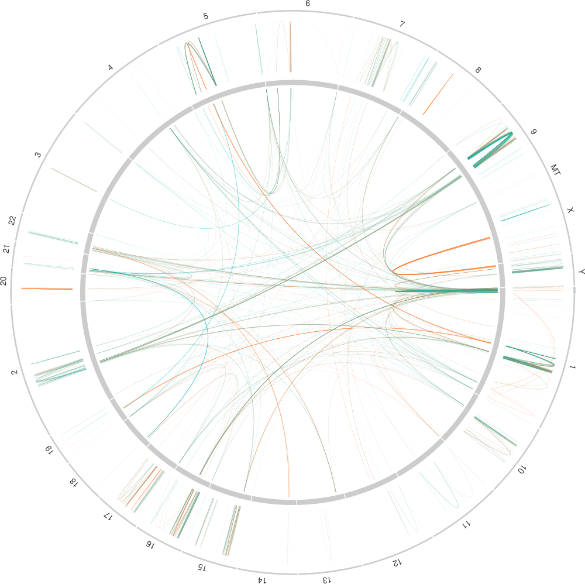

# ASGART: A Large Duplications Finder

`asgart` (A Segmental duplications Gathering and Refinement Tool) is a
multiplatform (GNU/Linux, macOS, Windows) tool designed to search for
large duplications amongst one or two DNA strands.


## Licensing

Asgart is distributed under the GPLv3 license. Please see the LICENSE
file.

# Why Should I Use ASGART?



You should use ASGART if

- you want to find segmental duplications, either direct, reversed
  and/or complement in a DNA sequence;

- you want to find highly similar parts between sequences up to the
  genome scale;

- you want to map highly similar sequences amongst genomes;

- you need an easy way to visualize the results.

# Installation

## Linux

Static binaries for Linux are available [here](https://github.com/delehef/asgart/releases) for x86_64 platforms.

## MacOS

Binaries for macOS are available [here](https://github.com/delehef/asgart/releases).

## From Sources

To build ASGART from sources, you need CMake, a C compiler and the
[Rust compiler](https://www.rust-lang.org/en-US/install.html).

Once these requirement are installed, clone the repository

```
git clone https://github.com/delehef/asgart.git
cd asgart
git submodule init
git submodule update
```

You can then build ASGART by running the Rust building tool

```
cargo build --release
```

Once the build is finished, you will find the binary in `target/release/`.


# Usage

## Simple Usage

First, let us take a look at a simple example:

```
asgart seq.fasta
```

This command will look for duplications in the `seq.fasta` file, then
write them in a JSON file in the folder where it was launched. ASGART
will probe using 20-mers, and guarantee that no duplication will
include gaps longer than 100bp in their arm-to-arm pairwise alignment.

If you wish to look for reversed-complemented duplications, use the
`-R` and `-C` options, that can be combined in `-RC`. And the `-v`
option will give you more informations as the progress goes on.

```
asgart -RCv seq.fasta
```

## Input

As input, ASGART takes one or more FASTA files containing the
sequences within which to look for duplications. They can be either in
the FASTA or multiFASTA format.

## Output

### JSON

By default, ASGART will write its result in a JSON file in the folder
where it was launched, following the following structure:

```
{
        "strand": {
                "name":   the file(s) set by the user,
                "length": total length of the dataset,
                "map": [
                        {
                                "name":     FASTA fragment name,
                                "position": offset in the FASTA file,
                                "length":   FASTA fragment length
                        }
                ]
        },

        "settings": {
                "probe_size":             probe size used,
                "max_gap_size":           maximal gap size used,
                "min_duplication_length": minimal length for a duplicon,
                "max_cardinality":        maximal size of a family,
                "skip_masked":            were masked nucleotides skipped?,
                "trim":                   the start and end position in the dataset if it was trimmed,
        },

        "families": [            # all families
                        [        # a single family
                            {    # a single duplicon in a family
                                    "global_left_position":  position of the left arm in the first strand,
                                    "global_right_position": position of the right arm in the second strand,

                                    "chr_left":              chromosomome in the first strand containing the left arm,
                                    "chr_right":             chromosomome in the second strand containing the right arm,

                                    "chr_left_position":     position of the left arm relative to its chromosome,
                                    "chr_right_position":    position of the right arm relative to its chromosome,

                                    "left_length":           length of the left arm of the duplicon (bp),
                                    "right_length":          length of the right arm of the duplicon (bp),

                                    "reversed":              true if the duplication is reversed, false otherwise,
                                    "complemented":          true if the duplication is complemented, false otherwise,
                                    "identity":              the distance between the two duplicons (0.0 if not computed)
                            },
                            ...
                        ]
        ]
}
```

### GFF

ASGART can also write its results in GFF2 or GFF3 files by using the
`--format` option. For instance, use `--format gff3` to save the
results in a GFF3 file.

## Options

### Functional

  - `--probe-size`/`-k` set the probing k-mers length (default: 20)

  - `--gap-size`/`-g` set the maximal gap size in a duplicon (default: 100)

  - `--min-length SIZE` specifies the minimal length (in bp) over
    which a duplication is kept in the final result and not discarded
    (default: 1000)

  - `--reverse`/`-R` look for duplication which second arm is reversed

  - `--complement`/`-C` look for duplication which second arm is
    complemented

  - `--skip-masked`/`-S` skip soft-masked zones, _i.e._ lowercased
    parts of the input files (default: no)

  - `--max-cardinality` specifies the maximal count of members in a
    duplication family (default: 500)

### Technical

  - `-h`, `--help` display an help screen

  - `-v`, `-vv`, `-vvv` increase verbosity level

  - `--out FILENAME` specifies the file in which the results will be
    written

  - `--prefix NAME` defines a prefix to prepend to the standard out
    file name

  - `--format OUT_FORMAT` sets the output format. Default is `json`,
    it can also be set to gff2 or gff3

  - `--threads COUNT` set the numbers of thread to use. Defaults to
    the number of cores abailable on the CPU

  - `--trim START END` run ASGART only on the specified area of the
    dataset

# Plotting

ASGART comes with a plotting tool, producing a visual overview of the
duplications. Currently, four types of plots are available: chord
plots, flat plots, genome plots and Circos plots.

## Quick Start

`asgart-plot chr22.json chr22_RC.json flat`

## Arguments

`asgart-plot` takes two mandatory arguments:

1. one or more JSON-files containing results from ASGART runs;

2. the type of plot to generate.

## Options

  - `-h`, `--help` display an help screen

  - `--out FILENAME` set output file name

  - `--min-length` set the minimal length (in bp) for a duplication to
    be plotted (default: 5000bp)

  - `--min-identity` set the minimal identity rate (in %) for a
    duplication to be plotted (default: 0%).

  - `--no-direct` do not plot direct duplications

  - `--no-reversed` do not plot reversed duplications

  - `--no-uncomplemented` do not plot non-complemented duplications

  - `--no-complemented` do not plot complemented duplications

  - `--features FILE` add an additional track containing features to
    plot alongside the duplications.

  - `--filter-features DISTANCE` don't plot duplications that are
    farther away then `DISTANCE` bp from the features in the track.

### Features File Format

Features files can be provided in two format. The first possibility is to use standard
GFF3 files, the other possibility being a custom, denser format described below.

The custom format features file format is made of a list of lines, one per feature, with
three semi-colons-separated values for each:

1. The label of the feature;
2. the start of the feaure. It may either be a single integer
   representing its absolute coordinate, or be of the form
   `NAME+OFFSET`, defining a start position at `OFFSET` from the start
   of `NAME` chromosomes (from the input FASTA file);
3. The length of the feaure in base pairs.

Comment lines starts with a `#`.

#### Example

```
# This is a comment line
# This is a feature named MYH14, 122358bp long, and starting at the 50,188,186th base of the chromosome 19
MYH14;19+50188186;122358
# This is a feature named Foo, starting on the 123,456,789th base of the input FASTA file and 1250bp long
Foo;123456789;1250
```

## Chord Plots

A chord plot represents duplications amongst a DNA fragment as arcs
linking point on a circle figuring a fragment bend over itself. Their
width is directly proportional to the length of the duplications they
represent.

### Example

`asgart-plot human_genome.json chord --out=flat.svg --min-length 20000`


## Flat Plot

Flat plots are made of two superposed horizontal lines, representing
the two fragments analyzed by ASGART, with lines linking left and
right parts of the duplications found, their width proportional to the
length of the duplication.

### Example

`asgart-plot human_Y.json flat --out=flat.svg --no-direct --no-uncomplemented --min-length 2000`


## Genome Plot

Genome plots draw one bar split in four lanes per fragment. The two
leftmost lanes represente respectively the intrachromosomal direct and
palindromic duplications families, and the two rightmost respectively
the interchromosomal direct and palindromic duplications families.

### Example

`asgart-plot chr10-chrY.json genome --min-length 10000`


## Circos Plots

ASGART can generate files that can be used as in input for the
[Circos](http://circos.ca/) plotting tool. Although the most important
files is arguably the `<out>.links` file (containing the duplicons to
plot), ASGART also generates an `<out>.conf` file and an
`<out>.karyotype` file, as to ensure a minimal working example to be
later expanded and/or customized according to your needs.

ASGART refers to files found in the Circos distribution. Thus, the
`CIRCOS_ROOT` environment variable should be set to point at the root
of the Circos distribution. Otherwise, ASGART will generate an
`<out>.conf` file containing `{circos_root}` placeholders to be
manually replaced.

### Example

`asgart-plot human_Y.json human_Y_RC.json circos --min-length 10000`

# Update Log

_Please note that ASGART following the [semver](https://semver.org/) versioning scheme, an increase in the major version number reflects a non backward-compatible update._

## v2.0

- ASGART does not differentiate anymore between strand A and strand B, but simply works on an arbitrarily large set of files. Thus, the user **SHOULD ONLY PROVIDE EACH FILE ONCE**. Moreover, it is not necessarily to concatenate multiple input files in a single one anymore. This **breaking change** should give more flexbility to the users and potentially simplifies pipelines.
- The ASGART automaton has been rewritten from scratch to take into account interlaced SDs at nearly no cost un
computation time. For this reason, interlaced duplication families research is now the only mode.
- ASGART will now remove large expanses of nucleotides to ignore (Ns and/or masked ones) in processed strands, thus
slightly improving performances.
- Taking advantage of these two new features, the parallelization system has been rewritten to (i) introduce
parallelism at the scale of the automaton; and (ii) make use of the “natural” aforementioned breakpoints as delimiters for chunks to process in parallel. By doing so, it is guaranteed (i) that no duplication families that would be situated between two chunks will be missed; (ii) that ASGART will make use of available cores even when processing less chunks than authorized threads.
- ASGART will now make use of the trimming feature to reduce memory consumption. The suffix array will be built only for the trimmed part, instead than for the whole input. The whole input will then be compared to the trimmed part, in contrary to what happened in version 1.x. Such an arrangement sacrifice some CPU power in exchange of a strongly reduced memory consumption when processing trimmed input. It can be used to process large sequences, by trimming them in several consecutive subsequences, then mergin the results later on.
- The JSON and GFF3 output formats have been modified to reflect the duplication families clustering. *Please note that they are thus incompatible with previous versions JSON files.*
- Plotting utilities have been modified to reflect these changes.
- The automaton will progressively grow the maximal gap size when extending large duplications, thus letting larger duplications arms be found in a less fragmented way.
- The logging system has been improved to be more detailed and more coherent in its way to present informations.
- Minor technical issues have been resolved: ASGART will correctly only use the `ID` field of FASTA files and not the subsequent informations; the progress bar does not glitch anymore.

## v1.5

- New, **non-retrocompatible** JSON output format containing positions of the duplicons both globally in the strand and relative to the fragment they are situated on
- `asgart-plot` can now superpose several files in a single plot
- ASGART can optionally compute the Levenshtein distance between duplicons
- User can set the chunking size for parallel processing (defaults to 1,000,000)
- Improve output files naming
- Fix a bug in post-processing
- Fix several minor bugs in logging system
- Minor under-the-hood refactoring and improvements

## v1.4.0

- Add Jaccard distance computation to estimate identity between duplicons
- Increase font size for feature plotting

## v1.3.3

- Fix regression

## v1.3.2

- Fix arg name runtime error

## v1.3.1

- Fix erroneous GFF3 output: seq names are now corrent, no superfluous underscore and correct, relative positions instead of absolute ones.

## v1.3

- Add a new plot format, _genome_
- Relabel “translate” to “complement”
- Fix the lack of color in SVG export
- `asgart-plot` can now read features tracks, either in custom or GFF3 format
- Add a setting to skip soft-masked zones
- Update dependencies

## v1.2

- Deep refactoring of the plotting system

## v1.1

- Add GFF2 & GFF3 export formats
- Improve build system
- Refactoring
- Fix various small bugs

## v1.0

- First published version
